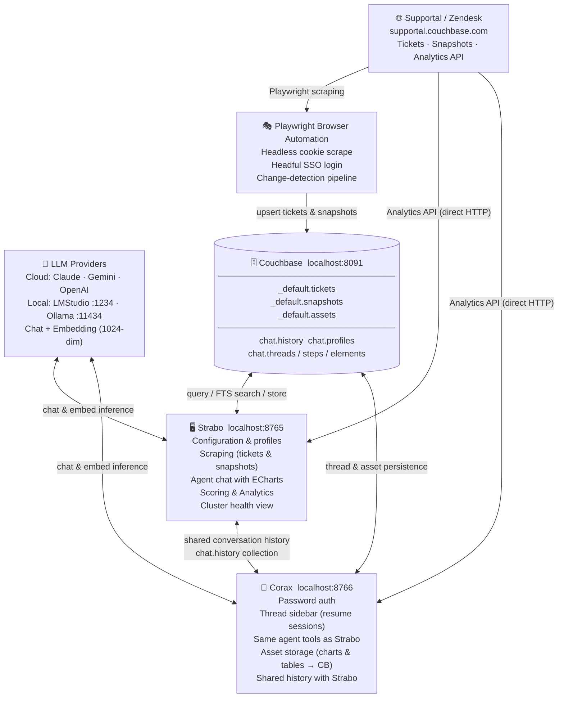

# Supportal AI Agent

A two-UI, AI-powered platform for analysing Couchbase support tickets. It scrapes ticket and cluster-topology data from Supportal/Zendesk via Playwright, stores everything in a local Couchbase instance, and exposes a multi-turn tool-calling agent through both a full-featured dashboard (**Strabo**) and a chat interface (**Corax**).

---

## Architecture

> **Full interactive diagram:** open [`docs/architecture.html`](docs/architecture.html) in a browser.
> **Workflow guide:** [`docs/workflow.html`](docs/workflow.html)



---

## Quick start

### Docker (recommended)

The fastest path — no local Python or Couchbase required.

**1. Copy and fill in the env file**

```bash
cp .env.example .env
```

Open `.env` and set at minimum:

| Variable | What to set |
|----------|-------------|
| `CB_PASS` | A strong password for the Couchbase admin account |
| `CHAINLIT_AUTH_SECRET` | Any random string (keeps Corax sessions valid across restarts) |
| `SUPPORTAL_COOKIE` | Optional — can be pasted in the Strabo UI instead |

**2. Start everything**

```bash
docker compose up --build
```

On first run `couchbase-init` runs automatically and:
- configures the cluster (services + memory quotas)
- creates the `supportal` bucket, scopes, collections, and all GSI indexes

This takes ~60 seconds the first time. Subsequent starts skip init and are fast.

**3. Open the apps**

| App | URL |
|-----|-----|
| Strabo (dashboard) | http://localhost:8765 |
| Corax (chat) | http://localhost:8766 |
| Couchbase Admin UI | http://localhost:8091 |

**4. Configure Strabo**

Go to **Configuration → Couchbase** and enter:

- **URL:** `couchbase://couchbase`
- **Username / Password:** the `CB_USER` / `CB_PASS` values from your `.env` (defaults: `Administrator` / your password)
- **Bucket:** `supportal`

Click **Save & Test** — it should connect immediately.

**Stopping**

```bash
docker compose down          # stop; data volumes are preserved
docker compose down -v       # stop and delete all data (full reset)
```

---

### Local (Python)

Use this if you want to iterate on the code without rebuilding images.

**Prerequisites**

- Python 3.12+
- [Couchbase Server](https://www.couchbase.com/downloads/) running locally on port 8091 (bucket, scopes, and indexes must be created manually or via the Strabo UI)
- At least one LLM provider (cloud API key **or** local LMStudio/Ollama)

**Setup**

```bash
python3 -m venv venv
source venv/bin/activate        # Windows: venv\Scripts\activate
pip install -r requirements.txt
playwright install chromium
```

**Run both apps together (Cursus)**

```bash
venv/bin/python run_cursus.py
# Strabo → http://localhost:8765
# Corax  → http://localhost:8766
```

Or run them individually:

```bash
# Terminal 1 — Strabo dashboard
venv/bin/python run_strabo.py

# Terminal 2 — Corax chat
venv/bin/python run_corax.py
```

Configure your Couchbase connection and Supportal cookie in the Strabo **Configuration** tab. Both UIs share the same profile.

---

## User interfaces

### Strabo — `localhost:8765`

| Tab | Purpose |
|-----|---------|
| **Configuration** | Connection profiles, CB settings, auth (cookie / SSO), embedding & AI model config, preflight checks |
| **Scraping** | Ticket scraping (cookie or headful login), snapshot scraping (listing, analytics stubs, topology) |
| **Results** | Filterable ticket table; CSV / Excel export |
| **Chat** | Multi-turn agent — ECharts visualisations, downloadable tables, streaming output |
| **Scoring & Analysis** | LLM complexity scoring, bulk rescore, cluster health dashboard |
| **Customers** | Organization browser, dynamic cluster↔app alias map |

### Corax — `localhost:8766`

- Password-authenticated login (username becomes your display name; any password accepted locally)
- Thread sidebar — click any prior session to resume it with full history and restored charts
- Same agent tools as Strabo; customer scope set from the ⚙ Settings panel per session
- Charts and tables persisted as base64 JSON in `chat.assets`, tagged with the prompt that generated them

---

## Agent tools

Both UIs share the same tool-calling agent (up to 5 turns per message). Tools are routed by data source:

| Source | Tools |
|--------|-------|
| **LOCAL** — Couchbase | `query_tickets` · `count_tickets` · `get_ticket` · `list_organizations` · `check_data_freshness` · `rescrape_ticket` · `rescrape_customer_tickets` |
| **LIVE** — Supportal Analytics API | `list_supportal_customers` · `query_supportal` |
| **OUTPUT** — render artifact | `generate_chart` · `generate_table` |

---

## Data model

```
Couchbase bucket: supportal
│
├── _default scope
│   ├── tickets        keyed  ticket::<zendesk_id>
│   ├── snapshots      keyed  snapshot::<cluster_uuid>::<version_int>
│   └── assets         keyed  asset::<session_id>::<uuid>
│
└── chat scope
    ├── history        shared Strabo ↔ Corax conversation log
    ├── profiles       per-user settings (Strabo)
    ├── threads        Corax session metadata + customer scope
    ├── steps          Corax message history
    ├── elements       Corax UI elements
    └── users          Corax authenticated users
```

Timestamps are epoch seconds (`last_scraped_at`, etc.).

---

## Authentication

Supportal access requires a valid session cookie. Two modes:

1. **Cookie paste** — paste a `_zendesk_session` / `_supportal_session` cookie from your browser into the Auth tab. Fastest for short sessions.
2. **Browser login (SSO)** — click *Open Browser*, complete the SSO flow in the launched Chromium window, then click *Confirm Login*. Session saved to `~/.supportal_cookies.json` and reused across restarts.

A 403 from the Analytics API means the session has expired; re-authenticate using either mode.

---

## LLM configuration

Each profile stores independent LLM settings for chat and embedding:

| Provider | Required |
|----------|---------|
| Claude | Anthropic API key |
| Gemini | Google API key |
| OpenAI | OpenAI API key + optional base URL |
| LMStudio | Base URL (default `http://localhost:1234`) |
| Ollama | Base URL (default `http://localhost:11434`) |

Switch providers at runtime from the Strabo **AI Models** config tab or from the Corax ⚙ Settings panel.

---

## Project layout

```
run_cursus.py              Start Strabo + Corax together (recommended)
run_strabo.py              Start Strabo only
run_corax.py               Start Corax only
apps/
  strabo/app.py            Strabo dashboard (NiceGUI)
  corax/app.py             Corax chat handler (Chainlit)
  mcp/server.py            MCP tool server for Claude Desktop
supportal/                 Shared library (scraping, CB, agent tools, scoring)
tools/                     CLI utilities
docker/
  couchbase-init.sh        One-shot Couchbase cluster + bucket initialisation
docs/
  architecture.html        Interactive architecture diagram
  workflow.html            Step-by-step workflow guide
public/custom.css          Corax UI overrides
requirements.txt           Python dependencies
Dockerfile                 App image (python:3.14-slim + Playwright Chromium)
docker-compose.yml         App + Couchbase + one-shot init service
.env.example               Environment variable template
```

---

## Roadmap

- [x] Ticket scraping — full re-scrape and change-detection mode
- [x] Snapshot scraping — listing, Analytics API stubs, topology backfill
- [x] Vector search — FTS hybrid index (BM25 + 1024-dim dot_product embeddings)
- [x] LLM agent — multi-turn tool-calling with ECharts / table rendering
- [x] Corax chat UI — thread persistence, asset storage, shared history
- [x] Supportal Analytics API tools — live cross-customer queries
- [x] Bulk rescrape tool — agent-triggered refresh of stale tickets
- [x] MCP tool server — exposes `query_tickets`, `vector_search`, `get_ticket`, `check_freshness`, `fetch_fresh_data` to Claude Desktop and any MCP client
- [x] Docker support — single `docker compose up` starts Strabo, Corax, and a fully-initialised Couchbase cluster
- [ ] PDF report generation — full per-customer or per-cluster narrative report
- [ ] Fleet analytics — dedicated cross-customer dashboards for CB version distribution and CBSE trend detection
