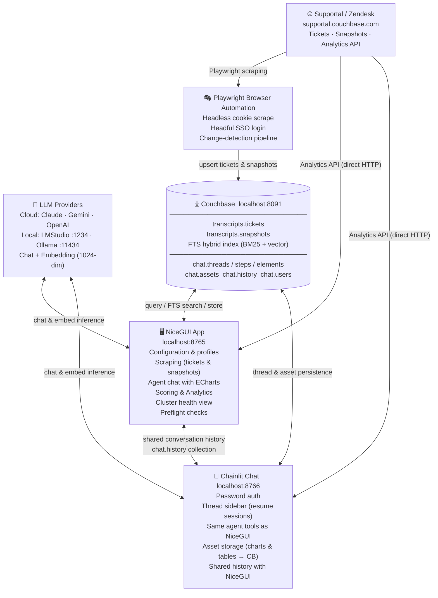

# Supportal AI Agent

A two-UI, AI-powered platform for analysing Couchbase support tickets. It scrapes ticket and cluster-topology data from Supportal/Zendesk via Playwright, stores everything in a local Couchbase instance, and exposes a multi-turn tool-calling agent through both a full-featured NiceGUI dashboard and a Chainlit chat interface.

---

## Architecture

> **Full interactive diagram:** open [`architecture.html`](architecture.html) in a browser.
> **STAR vs Scraper comparison:** [`docs/star-vs-scraper-comparison.md`](docs/star-vs-scraper-comparison.md)



---

## Quick start

### Prerequisites

- Python 3.12+
- [Couchbase Server](https://www.couchbase.com/downloads/) running locally on port 8091
- Playwright browsers: `playwright install chromium`
- At least one LLM provider (cloud API key **or** local LMStudio/Ollama)

### Setup

```bash
git clone https://github.com/agonyou/SupportalAIAgent.git
cd SupportalAIAgent
python3 -m venv venv
source venv/bin/activate        # Windows: venv\Scripts\activate
pip install -r requirements.txt
playwright install chromium
```

### Run

Open **two terminals** from the repo root:

```bash
# Terminal 1 — NiceGUI dashboard  →  http://localhost:8765
venv/bin/python supportal_nicegui_app.py

# Terminal 2 — Chainlit chat  →  http://localhost:8766
venv/bin/python run_chainlit.py --port 8766
```

Configure your Couchbase connection and Supportal cookie in the NiceGUI **Configuration** tab. Both UIs share the same profile, so you only configure once.

---

## User interfaces

### NiceGUI App — `localhost:8765`

| Tab | Purpose |
|-----|---------|
| **Configuration** | Connection profiles, CB settings, auth (cookie / SSO), embedding & AI model config, preflight checks |
| **Scraping** | Ticket scraping (cookie or headful login), snapshot scraping (listing, analytics stubs, topology) |
| **Results** | Filterable ticket table; CSV / Excel export |
| **Chat** | Multi-turn agent — ECharts visualisations, downloadable tables, streaming output |
| **Scoring & Analysis** | LLM complexity scoring, bulk rescore, cluster health dashboard |
| **Customers** | Organization browser, dynamic cluster↔app alias map |

### Chainlit Chat — `localhost:8766`

- Password-authenticated login (username becomes your display name; any password accepted locally)
- Thread sidebar — click any prior session to resume it with full history and restored charts
- Same agent tools as NiceGUI; customer scope set from the ⚙ Settings panel per session
- Charts and tables persisted as base64 JSON in `chat.assets`, tagged with the prompt that generated them

---

## Agent tools

Both UIs share the same tool-calling agent (up to 5 turns per message). Tools are routed by data source:

| Source | Tools |
|--------|-------|
| **LOCAL** — Couchbase | `query_tickets` · `count_tickets` · `get_ticket` · `list_organizations` · `check_data_freshness` · `rescrape_ticket` · `rescrape_customer_tickets` |
| **LIVE** — Supportal Analytics API | `list_supportal_customers` · `query_supportal` |
| **OUTPUT** — render artifact | `generate_chart` · `generate_table` |

---

## Data model

```
Couchbase bucket: rag  (configurable)
│
├── transcripts scope
│   ├── tickets        keyed  ticket::<zendesk_id>
│   └── snapshots      keyed  snapshot::<cluster_uuid>::<version_int>
│
└── chat scope  (auto-created on first Chainlit run)
    ├── threads         Chainlit session metadata + customer scope
    ├── steps           Message history
    ├── elements        UI elements
    ├── users           Authenticated users
    ├── feedback        Thumbs up/down ratings
    ├── assets          Charts & tables (base64 JSON + originating prompt)
    └── history         Shared NiceGUI ↔ Chainlit conversation log
```

Timestamps are epoch seconds (`last_scraped_at`, etc.).

---

## Authentication

Supportal access requires a valid session cookie. Two modes:

1. **Cookie paste** — paste a `_zendesk_session` / `_supportal_session` cookie from your browser into the Auth tab. Fastest for short sessions.
2. **Browser login (SSO)** — click *Open Browser*, complete the SSO flow in the launched Chromium window, then click *Confirm Login*. Session saved to `.playwright_supportal/` and reused across restarts.

A 403 from the Analytics API means the session has expired; re-authenticate using either mode.

---

## LLM configuration

Each profile stores independent LLM settings for chat and embedding:

| Provider | Required |
|----------|---------|
| Claude | Anthropic API key |
| Gemini | Google API key |
| OpenAI | OpenAI API key + optional base URL |
| LMStudio | Base URL (default `http://localhost:1234`) |
| Ollama | Base URL (default `http://localhost:11434`) |

Switch providers at runtime from the NiceGUI **AI Models** config tab or from the Chainlit ⚙ Settings panel.

---

## Project layout

```
supportal_nicegui_app.py   Main NiceGUI dashboard (single-file)
chainlit_app.py            Chainlit chat handler
run_chainlit.py            Chainlit launcher (Python 3.14 compatible, no nest_asyncio)
couchbase_data_layer.py    Chainlit BaseDataLayer backed by Couchbase
architecture.html          Interactive architecture diagram (open in browser)
.chainlit/config.toml      Chainlit server config (wide layout, custom CSS)
public/custom.css          Chainlit UI overrides
requirements.txt           Python dependencies
```

---

## Roadmap

- [x] Ticket scraping — full re-scrape and change-detection mode
- [x] Snapshot scraping — listing, Analytics API stubs, topology backfill
- [x] Vector search — FTS hybrid index (BM25 + 1024-dim dot_product embeddings)
- [x] LLM agent — multi-turn tool-calling with ECharts / table rendering
- [x] Chainlit chat UI — thread persistence, asset storage, shared history
- [x] Supportal Analytics API tools — live cross-customer queries
- [x] Bulk rescrape tool — agent-triggered refresh of stale tickets
- [ ] MCP tool server — expose pipeline as MCP tools for external agents
- [ ] PDF report generation — per-customer or per-cluster summary export
- [ ] Fleet analytics — cross-customer version distribution, CBSE trend detection
