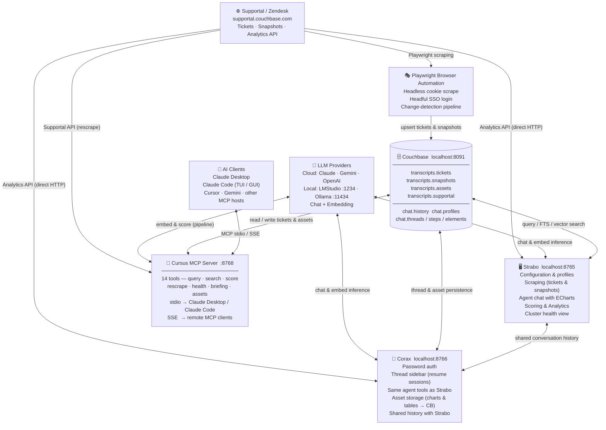

# Cursus Agent

An AI-powered platform for Couchbase support engineers to analyse support tickets, cluster health data, and customer portfolios. It ingests ticket and cluster-topology data from the internal Supportal portal, stores everything in a local Couchbase instance, and exposes a multi-turn tool-calling agent through two UIs: a full-featured dashboard (**Strabo**) and a chat interface (**Corax**). All three are launched together by the **Cursus** process supervisor.

> **Who this is for:** Couchbase support engineers and SEs who want AI assistance across their ticket queue — summarising cluster state, spotting patterns, generating customer-ready reports, and keeping data fresh automatically.

---

## Architecture

> **Full interactive diagram:** open [`docs/architecture.html`](docs/architecture.html) in a browser.



---

## Quick start

### Docker (recommended)

The fastest path — no local Python or Couchbase required.

**1. Copy and fill in the env file**

```bash
cp .env.example .env
```

Open `.env` and set at minimum:

| Variable | What to set |
|----------|-------------|
| `CB_PASS` | A strong password for the Couchbase admin account |
| `CHAINLIT_AUTH_SECRET` | Any random string (keeps Corax sessions valid across restarts) |

**2. Start everything**

```bash
docker compose up --build
```

On first run `couchbase-init` configures the cluster (services, memory quotas, bucket, scopes, collections, and all GSI indexes). Takes ~60 seconds the first time; subsequent starts skip init.

**3. Open the apps**

| App | URL |
|-----|-----|
| Strabo (dashboard) | http://localhost:8765 |
| Corax (chat) | http://localhost:8766 |
| Cursus MCP (SSE) | http://localhost:8768 |
| Couchbase Admin UI | http://localhost:8091 |

**4. Configure Strabo**

Go to **Configuration → Couchbase** and enter:

- **URL:** `couchbase://couchbase`
- **Username / Password:** values from your `.env` (defaults: `Administrator` / your `CB_PASS`)
- **Bucket:** `supportal`

Click **Save & Test** — should connect immediately.

**Stopping**

```bash
docker compose down        # stop; data volumes preserved
docker compose down -v     # stop and delete all data (full reset)
```

---

### Local (Python)

Use this when iterating on code — Cursus hot-reloads on file save.

**Prerequisites**

- Python 3.12+
- [Couchbase Server](https://www.couchbase.com/downloads/) running locally on port 8091
- At least one LLM provider configured (cloud API key **or** local LMStudio / Ollama)

**Setup**

```bash
python3 -m venv venv
source venv/bin/activate        # Windows: venv\Scripts\activate
pip install -r requirements.txt
playwright install chromium
```

**Run both apps together**

```bash
venv/bin/python run_cursus.py
# Strabo → http://localhost:8765
# Corax  → http://localhost:8766
# Ctrl+C stops both
```

Cursus watches `supportal/`, `apps/strabo/`, and `apps/corax/` for `.py` changes and automatically restarts only the affected app. Use `--no-watch` to disable.

**Run individually**

```bash
venv/bin/python run_strabo.py   # port 8765
venv/bin/python run_corax.py    # port 8766
```

Configure your Couchbase connection and AI models from the Strabo **Configuration** tab. Both UIs share the same profile.

---

## First-run walkthrough

After the app is running (Docker or local), complete these steps once to get data flowing.

### Step 1 — Connect to Couchbase

Open **Strabo** at `http://localhost:8765` → **Configuration → Couchbase**.

| Field | Docker value | Local value |
|---|---|---|
| URL | `couchbase://couchbase` | `couchbase://localhost` |
| Username | `Administrator` | your CB admin user |
| Password | value from your `.env` | your CB admin password |
| Bucket | `supportal` (or your choice) | same |

Click **Save & Test** — the status dot should turn green. Strabo creates all required scopes, collections, and GSI indexes on first connect.

---

### Step 2 — Authenticate with Supportal

Supportal (`supportal.couchbase.com`) is an internal host — **you must be on the Couchbase VPN**.

Go to **Configuration → Auth** and choose one method:

**Option A — Cookie paste (fastest)**
1. Open `supportal.couchbase.com` in your browser
2. Open DevTools → Application → Cookies → copy the `_zendesk_session` value
3. Paste it into the **Session Cookie** field in Strabo and click **Save**

**Option B — Browser SSO**
1. Click **Open Browser** in Strabo — a Chromium window launches
2. Complete the Okta SSO flow
3. Click **Confirm Login** in Strabo — the cookie is saved automatically

> Cookie sessions expire. If scraping starts failing, repeat this step.

---

### Step 3 — Configure an LLM provider

Go to **Configuration → AI Models**. You need at minimum an **embedding** provider for vector search and a **scoring** provider for LLM analysis. They can be the same or different.

| Provider | What to configure |
|---|---|
| **Ollama** (local, free) | Ensure Ollama is running; pull `nomic-embed-text` for embedding |
| **LMStudio** (local, free) | Load a 1024-dim embed model + a chat model; set the base URL |
| **Claude** | Paste your Anthropic API key |
| **Gemini** | Paste your Google API key |
| **OpenAI** | Paste your OpenAI API key |

Click **Save** after configuring. The **Preflight** tab lets you test connectivity to each provider.

---

### Step 4 — Run your first scrape

Go to **Scraping → Tickets**.

1. Type a customer name in the **Organization** field (e.g. `Western Union`)
2. Set **Max tickets** — start with `50` for a first run
3. Click **Scrape** — progress appears in real time

When the scrape finishes, Strabo automatically runs the **embed** and **score** pipeline on the fetched tickets. First run takes longer; subsequent runs use change detection to skip unchanged tickets.

Verify the data landed:
- Go to **Results** — tickets should appear in the table
- Go to **Scoring & Analysis** — charts should populate with the scraped org

---

### Step 5 — Verify Couchbase

Open the Couchbase Admin UI at `http://localhost:8091` → **Buckets** → click your bucket → **Documents**. You should see docs keyed `ticket::<zendesk_id>`.

To check counts from the Query workbench:

```sql
SELECT COUNT(*) FROM `rag`.`transcripts`.`tickets` WHERE type = 'ticket';
```

---

### Step 6 — (Optional) Wire the MCP server

To use the 14 Cursus MCP tools from Claude Desktop or Claude Code, see **[`docs/mcp-getting-started.md`](docs/mcp-getting-started.md)** for the full setup guide.

Quick summary for Claude Desktop — add to `~/Library/Application Support/Claude/claude_desktop_config.json`:

```json
{
  "mcpServers": {
    "cursus": {
      "command": "/path/to/Scraper/venv/bin/python",
      "args": ["/path/to/Scraper/run_mcp.py"],
      "alwaysAllow": [
        "check_connectivity", "query_tickets", "get_ticket", "search_tickets",
        "score_ticket", "list_customers", "get_customer_health", "get_portfolio_status",
        "get_morning_briefing", "get_scrape_status", "rescrape_customer_tickets",
        "cancel_scrape_job", "list_assets", "get_asset"
      ]
    }
  }
}
```

Restart Claude Desktop — the `cursus` tools appear immediately. Call `check_connectivity` first to confirm VPN and Couchbase are reachable before triggering a rescrape.

---

## User interfaces

### Strabo — `localhost:8765`

| Tab | Purpose |
|-----|---------|
| **Configuration** | Connection profiles, CB settings, auth (cookie / SSO), embedding & AI model config, preflight checks |
| **Scraping** | Ticket scraping (cookie or headful SSO), snapshot scraping (listing, Analytics API stubs, topology backfill) |
| **Results** | Filterable ticket table; CSV / Excel export |
| **Scoring & Analysis** | LLM complexity scoring, bulk rescore, analytics charts with drill-down, cluster health dashboard |
| **Customers** | Organization browser, dynamic cluster↔app alias map, health scores |
| **Assets** | Saved charts, reports, and tables from agent sessions — preview, download, or delete |
| **Chat** | Multi-turn agent with ECharts visualisations, downloadable tables, streaming output |

### Corax — `localhost:8766`

- Password-authenticated login (username becomes display name; any password accepted locally)
- Thread sidebar — click any prior session to resume it with full history and restored charts
- Same 40+ agent tools as Strabo; customer scope set from ⚙ Settings per session
- Charts and tables auto-persisted as assets in `transcripts.assets` and browsable via the **📦 Assets** quick action
- Shared conversation history with Strabo via `chat.history`

---

## Agent tools

Both UIs share the same tool-calling loop (up to 5 turns per message). The 40+ tools are grouped by purpose:

### Data retrieval — Couchbase (local)
| Tool | Description |
|------|-------------|
| `query_tickets` | N1QL ticket search with filters (org, priority, status, CB version, CBSE, date range) |
| `count_tickets` | Aggregate counts by field |
| `get_ticket` | Single ticket detail; auto-fetches live from Supportal if not in CB |
| `list_organizations` | All orgs with open ticket counts |
| `search_customer_names` | Fuzzy name resolution (5-step chain: LIKE → FTS → per-word → difflib) |
| `check_data_freshness` | Report staleness of local CB data vs. configurable thresholds |
| `vector_search` | Semantic similarity search over embedded ticket text |
| `query_local_snapshots` | Filter stored cluster snapshots by org, version, health |

### Scraping & refresh
| Tool | Description |
|------|-------------|
| `scrape_customer_tickets` | Full scrape of a customer's ticket history into CB |
| `rescrape_customer_tickets` | Discovers NEW tickets from Supportal + refreshes stale existing ones |
| `rescrape_ticket` | Re-fetch a single ticket live from Supportal |
| `fetch_snapshots` | Fetch and store cluster snapshot topology for a customer |
| `sync_snapshots` | Sync snapshot listing from the Supportal Analytics API |
| `backfill_snapshot_topology` | Backfill topology fields on tickets that have snapshot IDs |
| `backfill_last_comment_at` | Backfill last-comment timestamps on stored tickets |
| `get_scrape_status` | Check progress of a running background scrape job |

### Live Supportal API
| Tool | Description |
|------|-------------|
| `list_supportal_customers` | Live customer list from the Supportal Analytics API |
| `query_supportal` | Raw Analytics SQL++ query against the Supportal data warehouse |
| `get_briefing` | 24-hour digest of recent activity for a customer |

### Cluster health & snapshots
| Tool | Description |
|------|-------------|
| `get_cluster_health` | Full cluster topology: nodes, services, RAM, CPU, buckets, bad/warn items |
| `cluster_hw_chart` | Hardware profile chart (RAM / CPU distribution across nodes) |
| `analyze_snapshot` | Fetch a snapshot live and return a structured health summary; optionally save analysis notes |

### Analytics & scoring
| Tool | Description |
|------|-------------|
| `score_ticket` | LLM complexity/sentiment score for a single ticket |
| `batch_score_tickets` | Bulk score up to 50 tickets (unscored only, or force re-score) |
| `get_customer_health_score` | Composite health score for an org (0–100) |
| `check_sla_compliance` | SLA compliance check across a customer's open tickets |
| `get_portfolio_status` | Ranked portfolio overview: health, open P1s, SLA status across all customers |
| `get_digest` | Fleet-wide or customer-scoped digest of recent changes |

### Fleet-wide analytics
| Tool | Description |
|------|-------------|
| `query_fleet_tickets` | Cross-org N1QL with group-by (priority, status, version, CBSE) |
| `list_at_risk_clusters` | Clusters with elevated bad/warn items and no open ticket |
| `fleet_version_distribution` | CB version distribution across all stored snapshots |
| `fleet_cbse_impact` | CBSEs ranked by number of unique orgs affected |

### Output & persistence
| Tool | Description |
|------|-------------|
| `generate_chart` | Render an ECharts visualisation (12 chart types, 6 colour palettes) |
| `generate_table` | Render a filterable data table |
| `generate_customer_report` | Full markdown narrative report for a customer |
| `save_artifact` | Explicitly save a report / CSV / JSON / HTML asset to CB |
| `save_query` | Save a natural-language query for reuse |
| `list_saved_queries` | List previously saved queries for a customer |
| `tag_ticket` | Apply a label to a ticket doc in CB |
| `get_current_time` | Current UTC timestamp |

---

## Data model

```
Couchbase bucket: supportal (or any bucket name you configure)
│
├── transcripts scope
│   ├── tickets        keyed  ticket::<zendesk_id>
│   ├── snapshots      keyed  snapshot::<cluster_uuid>
│   └── assets         keyed  asset::<uuid>
│
└── chat scope
    ├── history        shared Strabo ↔ Corax conversation log  keyed  history::<org>
    ├── profiles       per-user Strabo settings                keyed  profile::<name>
    ├── threads        Corax session metadata + customer scope
    ├── steps          Corax message history
    ├── elements       Corax UI elements
    └── users          Corax authenticated users
```

All timestamps are Unix epoch seconds (`last_scraped_at`, `created_at`, etc.).

---

## Supportal access

Supportal (`supportal.couchbase.com`) is Couchbase's internal support portal. All API endpoints used by this project are currently open (no authentication required). Two authentication modes are retained for forward-compatibility if auth is re-enabled:

1. **Cookie paste** — paste a `_zendesk_session` cookie from your browser DevTools into the Auth tab. Fast for ad-hoc use.
2. **Browser login (SSO)** — click *Open Browser*, complete the SSO flow in the launched Chromium window, click *Confirm Login*. Session saved to `~/.supportal_cookies.json`.

> **Note for contributors:** The cookie/auth plumbing is retained throughout the codebase even though endpoints are currently open. If Supportal adds authentication, re-enable the commented block in `supportal/api_client.py:query_supportal_analytics`.

---

## LLM configuration

Each profile stores independent LLM settings for chat and embedding:

| Provider | Chat | Embedding | Notes |
|----------|------|-----------|-------|
| **Claude** | ✅ | — | Anthropic API key required |
| **Gemini** | ✅ | ✅ | Google API key required |
| **OpenAI** | ✅ | ✅ | API key + optional base URL |
| **LMStudio** | ✅ | ✅ | Base URL (default `http://localhost:1234`) |
| **Ollama** | ✅ | ✅ | Base URL (default `http://localhost:11434`) |
| **MLX** | — | ✅ | Apple Silicon local embeddings |

Switch providers at runtime from the Strabo **AI Models** config tab or the Corax ⚙ Settings panel.

---

## Project layout

```
run_cursus.py              Launch Strabo + Corax (+ MCP in SSE mode) with hot-reload
run_strabo.py              Launch Strabo only
run_corax.py               Launch Corax only
run_mcp.py                 Launch Cursus MCP server (stdio or SSE)
apps/
  strabo/app.py            Strabo dashboard — NiceGUI, all UI logic
  corax/app.py             Corax chat handler — Chainlit, session management
  mcp/server.py            Cursus MCP server — 14 tools for Claude Desktop / Code
supportal/
  agent_tools.py           All 40+ agent tool definitions + LLM tool-calling loop
  api_client.py            Supportal HTTP client (ticket listing, analytics, snapshots)
  cb_helpers.py            Couchbase helpers — embedding, vector/FTS/hybrid search, RRF
  scoring.py               LLM routing, RAG context assembly, multi-step reasoning
  prompts.py               System prompts, tool guidance, follow-up suggestion logic
  prompt_library.py        28 curated prompts across 7 categories
  constants.py             Shared constants (URLs, paths, regex)
  couchbase_data_layer.py  Chainlit data layer — threads, steps, elements in CB
  llm_providers.py         Multi-provider LLM client (Claude/Gemini/OpenAI/LMStudio/Ollama)
tools/                     CLI utilities
docker/
  couchbase-init.sh        One-shot Couchbase cluster + bucket + index initialisation
docs/
  architecture.html        Interactive architecture diagram
  workflow.html            Tool workflow reference
  mcp-getting-started.md   MCP server setup guide (Claude Desktop & Claude Code)
public/custom.css          Corax UI theme overrides
requirements.txt           Python dependencies
Dockerfile                 App image (python:3.12-slim + Playwright Chromium)
docker-compose.yml         App + Couchbase + one-shot init service (ports 8765/8766/8768)
.env.example               Environment variable template
```

---

## Roadmap & backlog

Items below represent the planned development trajectory. Contributors should check this section before starting work to avoid overlap.

### Completed ✅

- **Ticket pipeline** — full scrape, change-detection, new-ticket discovery vs. CB diff, auto-persist
- **Snapshot pipeline** — listing, Analytics API stubs, topology backfill, per-ticket enrichment
- **Vector search** — FTS hybrid index: BM25 + 1024-dim dot_product embeddings, RRF ranking
- **LLM agent** — multi-turn tool-calling, 5-round loop, status callbacks, cancel support, error classification
- **Strabo dashboard** — 6 tabs, 12 chart types, 6 palettes, SVG/PNG export, drill-down analytics
- **Corax chat UI** — thread sidebar, session resume, asset storage, file upload, shared history with Strabo
- **Assets system** — auto-save charts/tables/reports to CB; preview, download, delete in both UIs
- **Prompt library** — 28 curated prompts across 7 categories; customer-injection; two-step browser
- **Auth removal** — all Supportal endpoints confirmed open (v2.6.2); cookie plumbing retained
- **Fuzzy customer resolution** — 5-step chain (LIKE → local CB → Supportal FTS → per-word → difflib)
- **Cursus supervisor** — watchfiles-based hot-reload; per-app restart routing; 2s debounce
- **Fleet analytics** — `query_fleet_tickets`, `list_at_risk_clusters`, `fleet_version_distribution`, `fleet_cbse_impact`
- **MCP tool server** — 14 tools across tickets, customers, scrape jobs, and assets; stdio (Claude Desktop/Code) and SSE (remote) transports; `alwaysAllow` configured for prompt-free operation; `get_morning_briefing` fleet briefing tool
- **Docker** — single `docker compose up` starts app + fully-initialised Couchbase + MCP SSE server on :8768

### Phase 3 — Fleet dashboard (UI)

**Goal:** Shift from single-customer interrogation to fleet-wide visibility without needing to chat.

- [ ] **Fleet tab in Strabo** — top-level tab with auto-loading charts: CB version distribution (donut), open tickets by org (horizontal bar), priority breakdown (stacked bar), bad-item heatmap, 30-day ticket trend
- [ ] **Click-through** — clicking any fleet chart element loads that customer in the Scoring tab
- [ ] **Refresh controls** — "Refresh fleet data" button + last-updated timestamp
- [ ] **At-risk alerts panel** — clusters with elevated bad/warn and no open ticket, sorted by risk score `(bad * 3 + warn) * recency_factor`

### Phase 3 — Portfolio management

**Goal:** Let users define named groups of customers and get aggregate health across the group.

- [ ] **Portfolio CRUD** — `create_portfolio`, `list_portfolios`, `get_portfolio_health` agent tools; stored in CB as `saved_portfolio::<name>`
- [ ] **Portfolio health summary** — aggregate score, SLA compliance, open P1 count across member orgs
- [ ] **Fleet dashboard portfolio switcher** — filter all fleet charts to a selected portfolio

### Phase 4 — Agent-driven data freshness

**Goal:** The agent proactively keeps data fresh without the user having to trigger scrapes manually.

- [ ] **Followed customers import** — fetch Supportal's per-user "followed customers" list at profile creation; store as `profile.accounts[]`; drive freshness automation and morning briefing scope from this list
- [ ] **Freshness thresholds** — configurable per priority: critical = 4h, normal = 24h
- [ ] **`fetch_fresh_data` tool** — calls `run_ticket_pipeline` / `run_snapshot_pipeline` headlessly from within an agent turn when data is stale
- [ ] **Stale data warning** — banner on agent responses when the user skips a suggested refresh
- [ ] **System prompt guidance** — "always call `check_freshness` before answering staleness-sensitive questions"

### Phase 4 — PDF report generation

- [ ] Evaluate WeasyPrint (HTML→PDF) vs. Playwright PDF
- [ ] `render_pdf_report(sections)` agent tool — markdown + chart specs → downloadable PDF
- [ ] Couchbase-branded PDF template; ECharts embedded as PNG via headless Chromium
- [ ] "Export as PDF" button on Assets tab for report-type assets
- [ ] Corax: PDF sent as file attachment after generation

### Phase 4 — Session management

- [ ] **Session picker** — list last 10 Corax sessions from CB, click to resume with context
- [ ] **`resume_session(session_id)`** — loads prior history + injects session summary into system prompt
- [ ] **Prior context chip** — collapsible summary block at top of resumed chat
- [ ] **Auto topic tagging** — extract and persist topic tags via `save_chat_session`

### Phase 4 — Scheduled pipeline

**Goal:** Headless background operation; no UI required for data refresh.

- [ ] **`pipeline_runner.py`** — standalone script; reads CB config from env vars
- [ ] **CLI:** `python pipeline_runner.py --org "Amex" --scope tickets,snapshots --embed --score`
- [ ] **Cron-compatible** — exits 0/1; structured JSON log to stdout
- [ ] **Change detection** — only re-embed/re-score when status changed or data is stale
- [ ] **`_OP_STATUS` via CB** — persist pipeline progress to a CB doc so Strabo/Corax can display in-progress state from a detached run

### Future / exploratory

- [ ] **Salesforce integration** — additive account enrichment (ARR, renewal date, SE/AE assignment); `accounts` collection in CB; `org_aliases` maps SF account name → Supportal org string. **Status: blocked** — no SFDC API access; Okta SSO adds Connected App OAuth complexity. Re-enable if access becomes available. Design is complete in `docs/`.
- [ ] **A2A multi-agent** — data freshness agent + analysis agent coordinating via Agent-to-Agent protocol
- [ ] **`fetch_url` tool** — unified live URL fetcher for `docs.couchbase.com` and Supportal pages; domain whitelist; 5–15 min in-process cache; CB URL registry (links/metadata only, no content stored)
- [ ] **Docs link registry** — pre-seed CB with known doc entry points (SDK overviews, release notes, search index); `search_couchbase_docs` agent tool

---

## Contributing

### Getting oriented

1. Read the architecture diagram (`docs/architecture.html`) first
2. All agent tools are defined in `supportal/agent_tools.py` — each is a dict in `AGENT_TOOLS` plus a dispatch branch in `_execute_agent_tool()` in `apps/strabo/app.py`
3. Shared library code lives in `supportal/`; UI-coupled code stays in `apps/strabo/app.py` or `apps/corax/app.py`
4. The Couchbase scope for tickets/snapshots/assets is typically `transcripts`; chat persistence uses the `chat` scope

### Adding a new agent tool

1. Add the tool definition dict to `AGENT_TOOLS` in `supportal/agent_tools.py`
2. Add a dispatch branch in `_execute_agent_tool()` in `apps/strabo/app.py`
3. Update the tool description in this README's agent tools table
4. Bump `__version__` in `apps/strabo/app.py`

### Branch conventions

- `main` — protected; stable releases only
- `scaling` — active development branch; merge here first
- Feature branches: `feature/<short-description>`

### Secrets

Credentials never go in the repo. The settings file (`~/.supportal_settings.json`) and cookies (`~/.supportal_cookies.json`) live in `$HOME` and are never committed. See `.gitignore` for the full exclusion list.
