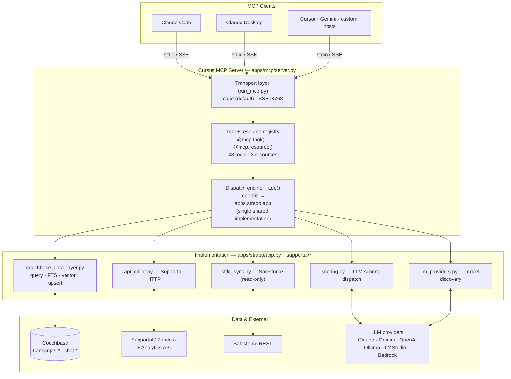

# Cursus MCP — Architecture & Customization Guide

This document explains **what the Cursus MCP server incorporates** and **where the customization entry points are**, so you can extend it without reverse-engineering the codebase. For install/connect steps, see [`mcp-getting-started.md`](mcp-getting-started.md).

---

## 1. The big picture



**Key design fact:** the MCP server is a *thin façade*. Every tool handler resolves the real implementation through one function — `_app()` in `apps/mcp/server.py` — which lazily imports `apps.strabo.app` via `importlib`. That means the MCP server, the Strabo dashboard, the Corax chat app, and the Cursus Unified shell all call the **same** implementation. Fix a bug or add a capability once, and every surface gets it.

```python
# apps/mcp/server.py
def _app():
    global _pipeline
    if _pipeline is None:
        _pipeline = importlib.import_module("apps.strabo.app")
    return _pipeline
```

---

## 2. Transport layer

| Transport | Command | Use for |
|---|---|---|
| **stdio** (default) | `python run_mcp.py` | Claude Code / Desktop launching the server per-session |
| **SSE** | `python run_mcp.py --transport sse --port 8768` | The Docker stack, remote clients, or multiple clients sharing one server |

Transport selection lives entirely in `run_mcp.py`; the tool code is transport-agnostic.

---

## 3. Tool catalog (what's incorporated)

48 tools + 3 resources, grouped by domain. All are defined in `apps/mcp/server.py` with `@mcp.tool()`.

### Tickets & search
| Tool | Purpose |
|---|---|
| `query_tickets` | Structured N1QL filter — org, status, priority, keyword, age |
| `get_ticket` | Full ticket detail — description, comments, topology, scores |
| `search_tickets` | Semantic vector (FTS) search by meaning |
| `score_ticket` | Run LLM scoring on a ticket, persist to CB |
| `find_customers` | Fuzzy customer discovery by topic/keyword |

### Customer & fleet health
| Tool | Purpose |
|---|---|
| `list_customers` · `get_customer_health` · `get_portfolio_status` · `get_morning_briefing` · `get_account_contacts` | Per-customer and fleet-wide health, ranking, briefings, and AE/TSE/PSE contacts |

### Freshness & scraping
| Tool | Purpose |
|---|---|
| `check_connectivity` | VPN + Couchbase + Supportal reachability preflight |
| `smart_refresh` | **Lightweight** six-signal diff (new/status/solved/priority/stub/stale-open) → pull only changes → background enrichment |
| `rescrape_customer_tickets` | **Heavy** full Supportal refresh (explicit use only) |
| `check_data_freshness` · `get_scrape_status` · `wait_for_scrape` · `cancel_scrape_job` | Freshness markers and scrape-job lifecycle |

### Cluster topology & analytics
| Tool | Purpose |
|---|---|
| `query_cluster_topology` | Per-node services / RAM / disk / version from Supportal nutshellresults |
| `query_supportal_analytics` | Read-only SQL++ against the live Supportal Analytics API |

### Assets & reports
| Tool | Purpose |
|---|---|
| `generate_health_report` · `generate_ticket_report` · `generate_cluster_health_chart` | Branded HTML report/chart generation from live CB data |
| `list_assets` · `get_asset` · `export_asset` | Saved-asset lifecycle |
| `save_customer_brand` · `get_customer_brand` | Per-customer brand kits (colors, logo, terminology) |

### Salesforce (read + one gated write)
| Tool | Purpose |
|---|---|
| `sync_sfdc_data` | Refresh the local SFDC mirror (accounts + opportunities) |
| `get_my_sfdc_accounts` · `list_sfdc_accounts` · `get_account_opportunities` · `get_se_opportunities` · `get_account_intelligence` | Account/opportunity/ARR views, blended with support health |
| `lookup_sfdc_account` | Ad-hoc **live read-only** lookup for ANY account (AE, type, closed-won TCV, open opps) — not just your book; ephemeral |
| `get_se_opp_worklist` | Live read-only weekly SE-Section worklist (CQ+3), ranked by staleness, with latest-entry reality-check + Opp IDs |
| `get_se_manager_rollup` | Live read-only "who's-behind across the team" rollup, grouped by SE, rolls up to the SE manager |
| `apply_se_opp_updates` | **The one gated WRITE.** `dry_run=True` default (returns plan); SE-Section field whitelist rejects computed rollups; every real write audited to a `sewrite::` marker. First write to a customer system of record |
| `get_sfdc_field_mapping` · `update_sfdc_field_mapping` | Inspect/adjust the SFDC→CB field map (mapping only) |

### Pins (personal lens)
| Tool | Purpose |
|---|---|
| `pin_opportunity` · `pin_account` · `unpin` · `list_pins` | Tag an opp/account as "owned"/"watching" in `transcripts.pins` — additive lens, never overrides the faithful SFDC mirror |
| `reconcile_pins` | Surface pin-vs-SFDC mismatches (pinned-not-in-SFDC / SFDC-not-pinned); governance, never mutates SFDC |

### Observability / governance
| Tool | Purpose |
|---|---|
| `record_feedback` · `record_insight` · `record_automation_run` · `get_failure_insights` | Human feedback, candidate insights, automation-run logging, and the failure knowledge base |

### Resources (read-only URIs)
| URI | Returns |
|---|---|
| `customers://list` | All customers + open ticket counts |
| `tickets://{organization}` | Open tickets for a customer |
| `health://{organization}` | Health summary for a customer |

---

## 4. Data layer

All state lives in one Couchbase bucket (`supportal` in Docker; `rag` code fallback — see getting-started). Two scopes:

| Scope | Collections | Owner |
|---|---|---|
| `transcripts` | `tickets`, `snapshots`, `assets`, `brands`, `markers`, `insights`, `accounts`, `opportunities` | MCP + all apps |
| `chat` | `users`, `threads`, `steps`, `elements`, `feedback`, `history`, `profiles` | Corax only |

Access is centralized in `supportal/couchbase_data_layer.py` (N1QL, FTS/vector search, upserts). Connection settings resolve in `_cfg()` (`apps/mcp/server.py`): **env vars override the active Strabo profile**, e.g. `CB_URL`, `CB_BUCKET`, `CB_USER`, `CB_PASS`, `CB_TLS`, `CB_SCOPE`, `CB_COLLECTION`.

---

## 5. External integrations

| System | Module | Notes |
|---|---|---|
| **Supportal / Zendesk** | `supportal/api_client.py` (Analytics API), Playwright scrape (tickets) | `BASE_URL = https://supportal.couchbase.com`; internal host — VPN required for scraping |
| **Salesforce** | `supportal/sfdc_sync.py` | OAuth REST, **read-only** — syncs into `transcripts.accounts` / `.opportunities` |
| **LLM providers** | `supportal/scoring.py` (inference), `supportal/llm_providers.py` (model discovery) | Scoring: `claude`, `gemini`, `ollama`, `lmstudio`, `bedrock`. Embedding: `ollama`, `lmstudio`, `gemini`, `openai` |

---

## 6. Customization entry points

Where to plug in, by intent:

### Add a new MCP tool
1. Implement the logic as a function in `apps/strabo/app.py` (so every surface can use it).
2. Add a thin `@mcp.tool()` wrapper in `apps/mcp/server.py` that calls `_app().your_function(...)` and returns `json.dumps(...)`.
3. If the in-app agent should call it too, add a JSON schema entry in `supportal/agent_tools.py` and a one-line note in `supportal/prompts.py`.
4. For SSE clients, no restart of Claude Code is needed for stdio; just reconnect.

*(This is exactly the pattern `query_cluster_topology` follows — a good template to copy.)*

### Add an LLM provider (scoring or embedding)
- **Scoring:** add an `elif provider == "yourprovider":` branch in the dispatch in `supportal/scoring.py` (~line 142). Lowercase the provider name before comparing — case-mismatch has bitten this dispatch twice.
- **Embedding:** extend the embedding helpers in `apps/mcp/server.py` (`_emb_model`, `_emb_base_url`, `_emb_dims`) and the provider list in `supportal/llm_providers.py`.

### Change the Couchbase target (bucket / scope / collection)
- No code change — set `CB_BUCKET`, `CB_SCOPE`, `CB_COLLECTION` env vars, or edit the active Strabo profile. `_cfg()` reads env first, profile second.
- For a fresh cluster, mirror the collection set in `docker/couchbase-init.sh` (§9 Collections).

### Add a Couchbase collection
1. Add a `curl … POST …/collections -d "name=yours"` line in `docker/couchbase-init.sh`.
2. Add a lazy-create guard in the app (see `_ensure_markers_collection` in `apps/mcp/server.py` for the pattern) so non-Docker installs get it too.

### Customize reports & branding
- Report templates: `docs/templates/*.html` (health, cluster, cadence, account status, portfolio). Placeholder tokens + inline comments describe each field's source tool.
- Brand kits: `save_customer_brand` / `get_customer_brand` drive per-customer colors/logo/terminology applied by the `generate_*` tools.

### Adjust agent behavior & prompts
- System prompt, classification, extraction, summary prompts: `supportal/prompts.py`.
- Tool-selection guidance the in-app agent reads: also `supportal/prompts.py` (kept next to the `agent_tools.py` schemas).

### Adjust the Salesforce field map
- `get_sfdc_field_mapping` / `update_sfdc_field_mapping` expose the SFDC→CB field mapping at runtime. Sync stays read-only against Salesforce regardless.

### Clone location & filesystem paths
- **The repo is location-independent.** `run_mcp.py` and the run scripts self-locate via `Path(__file__).parent`, so you can clone anywhere under any directory name — nothing assumes a `Scraper/` folder. Client config just needs the absolute path to *your* clone (use `"$(pwd)/run_mcp.py"` from inside it).
- Writable scratch paths are env-configurable and default to project-relative: `SNAP_DEBUG_DIR` (snapshot debug dumps → `<project-root>/snap_debug`). Settings/cookies live under `~` by default (`~/.supportal_settings.json`, `~/.supportal_cookies.json`).

---

## 7. Where NOT to customize

- **Don't fork logic into `apps/mcp/server.py`.** Tool handlers should stay thin wrappers over `_app()`; putting real logic here means Strabo/Corax/Unified won't get it.
- **Don't write back to Salesforce.** The integration is deliberately read-only; the field-mapping tools change the *local* map only.
- **Don't hardcode a bucket name.** Use `_cfg()` / env so Docker (`supportal`) and standalone (`rag`) both work.
